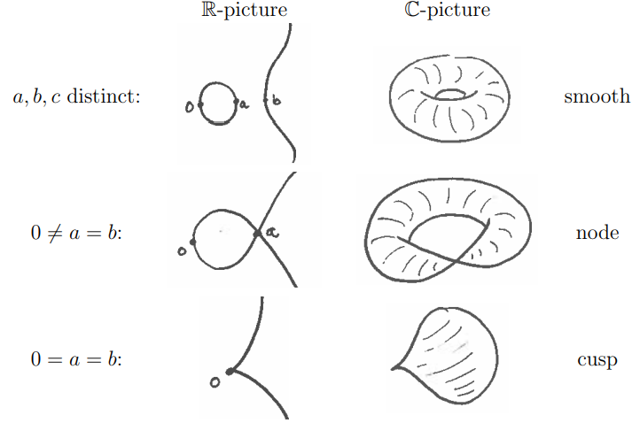
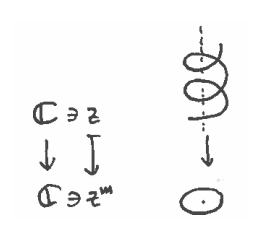
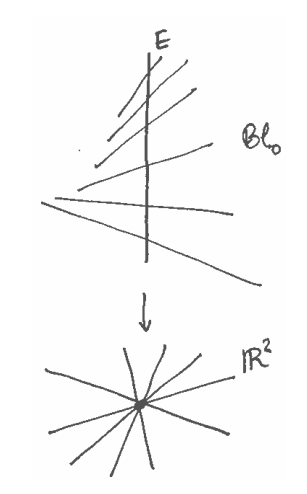
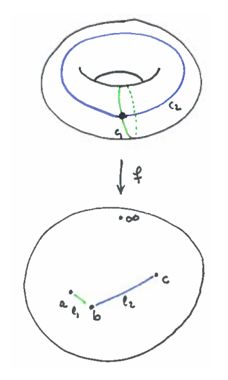
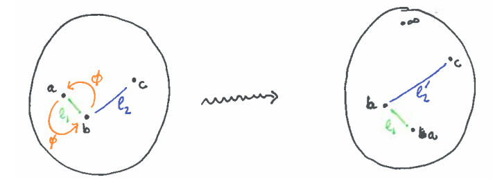
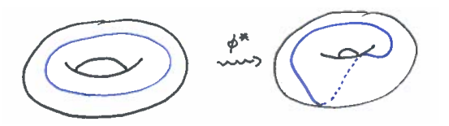

# 圖示版怪異層(Perverse Sheaf)的指南

**Geordie Williamson 著**

## 1. 引言

當我們閱讀 Goresky 和 MacPherson 的論文，首次接觸到交叉上同調和怪異層時，會覺得它們生活在一個充滿幾何和拓撲直覺的世界中。然而，大多數現代關於怪異層的敘述卻顯得枯燥且形式化。它們像是一個強大的黑盒子，靜靜地坐落在神祕的導出範疇中。

本講義的目標（由一位「無辜的旁觀者」撰寫）是試圖重新捕捉怪異層背後的幾何直覺。重點將放在圖像和例子上，而不是定理。當然，理解怪異層的形式基礎也很重要，這些內容會在講義中適當展開。我們希望這些講義能為怪異層更正式的文獻提供一種平衡。

推薦參考文獻以保持動力：
- Kleiman, *The development of intersection homology theory*.
- de Cataldo, Migliorini, *The decomposition theorem, perverse sheaves and the topology of algebraic maps*.

---

## 2. 代數簇看起來是什麼樣子？

怪異層為理解代數簇的拓撲結構提供了有力工具。尤其是在理解代數簇之間的代數映射的拓撲時，怪異層的作用尤為突出。因此，對代數簇（視為帶有奇點的流形）拓撲的興趣，是理解怪異層的必要前提。

研究複代數簇拓撲的一個問題是維數增長很快，難以畫出好圖。我們將只關注複數情形，但有時對實點的理解也有幫助。找到合適的圖像往往是解決問題的一半！

舉個例子，考慮方程 $y^2 = x(x-a)(x-b)$ 在 $\mathbb{C}^2$ 中。取射影閉包（即 $y^2z = x(x-az)(x-bz)$ 在 $\mathbb{P}^2$），得到如下橢圓曲線：

- 當 $a, b, c$ 互異時：
  - 實圖像：一個光滑的環
  - 複圖像：甜甜圈（環面）
- 當 $0 \neq a = b$ 時：
  - 實圖像：有一個節點
  - 複圖像：有一個節點的曲線
- 當 $0 = a = b$ 時：
  - 實圖像：有一個尖點
  - 複圖像：有一個尖點的曲線

每條曲線都會退化為下一條，這在拓撲上很容易想像。

流形「局部處處一樣」可以用自微分同胚群或自同胚群在連通流形上傳遞作用來表達。

但對於奇異代數簇，這種性質通常不成立。例如，上述節點橢圓曲線的自同胚必須固定唯一的奇異點。

---

## 3. 代數簇的態射看起來是什麼樣子？

接下來我們需要有一批代數簇態射的例子。我們幾乎總是假設我們的態射是正則的（通常甚至是射影的）。下面討論一些例子：

**曲線之間的態射：** 設 $X, Y$ 是光滑連通曲線，$f: X \to Y$ 是一個態射。除非 $f$ 是常值（無趣），否則 $f$ 是有限映射，並且在 $Y$ 的某個開集上是étale映射。固定 $U \subset Y$，$f$ 在 $U$ 上的纖維由 $\pi_1(U)$ 在 $f^{-1}(u)$ 上的傳遞作用唯一確定。

在每個分歧點附近，$f$ 的結構很簡單。設 $B$ 是 $y_0$ 附近的小圓盤，$\ell$ 是 $\pi_1(B, y)$ 的生成元，則 $\ell$ 在 $f^{-1}(B)$ 上的作用給出了分支結構。每個連通分支看起來像「樓梯」$z \mapsto z^m$。

**練習 3.1**：在上述設定下，假設 $X, Y$ 是射影的。$X$ 和 $Y$ 的歐拉示性數與上述數據有何關係？

**曲面之間的雙有理映射：** 典型例子是曲面上一點的 blow-up。如下圖所示：

（圖：blow-up 後的 $E$ 和 $\mathbb{R}^2$）

其他重要例子包括（有理）曲面奇點的分解：

- $\{xy = z^2\} \subset \mathbb{C}^3$ 的極小分解
- $\{x^2 + y^3 = z^5\} \subset \mathbb{C}^3$ 的極小分解

雖然這些有理曲面奇點很美，但實際上有大量更複雜的曲面奇點。

**帶奇點的族**：在代數幾何中，「族」通常指某個適當的滿射 $f: X \to Y$，$Y$ 是「較小」的（如曲線），$f$ 的纖維視為 $Y$ 上參數化的變動成員。通常要求平坦性以保證纖維不會跳躍太大。

在同調論中我們習慣於「每個映射都是纖維化」，但在代數幾何中，幾乎所有映射都會有奇異纖維。

---

## 4. 關於橢圓曲線族的更多細節

考慮由 $y^2 = (x-a)(x-b)(x-c)$ 給出的橢圓曲線族，參數空間為

$$
U := \{(a, b, c) \in \mathbb{C}^3\}
$$

記 $f: X \to U$ 為投影。給定 $(a, b, c) \in U$，記 $E_{a,b,c} := f^{-1}(a, b, c)$ 為纖維。記 $U_{reg} := \{(a, b, c) | a, b, c \text{ 不相等}\}$。

則 $f$ 是 $U_{reg}$ 上的光滑射影橢圓曲線族。

假設 $(a, b, c) \in U_{reg}$，且（便於想像）$a, b$ 很近，$c$ 很遠。則 $E_{a,b,c}$ 可視為 $\mathbb{P}^1$ 上分歧於 $a, b, c, \infty$ 的二重覆蓋。

記 $\ell_1, \ell_2$ 為連接 $a$ 與 $b$、$b$ 與 $c$ 的線段，$c_1, c_2$ 為其在 $E_{a,b,c}$ 上的逆像。由 $f$ 是二重覆蓋可知，$E_{a,b,c}$ 中有兩個 $S^1$。

**練習 4.1**：證明在固定 $c_1, c_2$ 的取向後，它們給出 $H^1(E_{a,b,c})$ 的一組基。

現在可以想像 $\ell_1, \ell_2$ 隨 $a, b, c$ 變化而移動。例如，若沿逆時針方向交換 $a$ 和 $b$，則 $E_{a,b,c}$ 與 $E_{b,a,c}$ 是典範同構的。誘導的映射 $\phi^*$ 在循環上為：

$$
\ell_1 \mapsto \ell_1, \quad \ell_2 \mapsto \ell_2' \sim \ell_1 + \ell_2
$$

**練習 4.2**：驗證 $\phi^*$ 在 $H_1(E_{b,a,c})$ 上的描述：

$$
c_1 \mapsto c_1, \quad c_2 \mapsto c_2 + c_1
$$

實際上，這就是經典的 Dehn 扭。 

